# LibraryManagementSystem

## Projenin Amacı

Kütüphane Yönetim Sistemi, kütüphanedeki kitapları etkili bir şekilde yönetmek, kullanıcıların kitap ekleme, listeleme, güncelleme ve silme işlemlerini gerçekleştirmesini sağlamak amacıyla geliştirilmiş bir yazılım sistemidir. Bu sistem, ASP.NET Core teknolojisi kullanılarak geliştirilmiş olup, SQLite veritabanı ile kitap bilgileri güvenli bir şekilde saklanır. Kullanıcılar, kitapların başlık, yazar, yayın yılı, kategori gibi bilgilerini kolayca güncelleyebilir ya da yeni kitaplar ekleyebilir. Ayrıca sistemde, kitapların listelenmesi ve silinmesi gibi temel işlemler de yapılabilmektedir.

Projenin amacı, kütüphanedeki kitapların yönetimini dijital ortamda kolaylaştırmak, yönetimsel süreçleri hızlandırmak ve kullanıcıların kitaplara daha hızlı ulaşmasını sağlamaktır. MVC mimarisi ile yapılandırılan proje, Bootstrap ile modern ve duyarlı (responsive) bir kullanıcı arayüzü sunar. Kullanıcı dostu tasarımı sayesinde kütüphane yönetimi daha verimli hale getirilir.

Bu sistem, kütüphane yönetiminde hem kullanıcı hem de yönetici açısından büyük kolaylıklar sağlar ve veritabanı entegrasyonu sayesinde kullanıcıların kitapları güvenli ve verimli bir şekilde yönetmesini sağlar.   

## Kullanılan Teknolojiler

ASP.NET Core: Web uygulamaları geliştirmek için kullanılan, açık kaynaklı ve çapraz platform desteği sunan bir framework’tür. Bu projede, web uygulamasının backend kısmı ASP.NET Core kullanılarak geliştirilmiştir. MVC mimarisi tercih edilmiştir.

SQLite: Hafif, taşınabilir ve ilişkilendirilmiş veritabanı yönetim sistemi olan SQLite, kitap bilgilerini ve kullanıcı işlemlerini saklamak için kullanılmıştır. Veritabanı dosyası (.db) şeklinde yerel bir ortamda çalışır.

Entity Framework Core: .NET Core uygulamalarında veritabanı işlemleri gerçekleştirmek için kullanılan bir Object-Relational Mapping (ORM) aracıdır. Bu proje, Entity Framework Core kullanılarak SQLite veritabanı ile veri erişim işlemleri yapılmaktadır. CRUD (Create, Read, Update, Delete) işlemleri bu teknoloji ile kolaylıkla gerçekleştirilmiştir.

HTML: Web sayfalarının yapısını ve içeriğini tanımlamak için kullanılan işaretleme dilidir. Bu projede, kitap bilgilerini göstermek ve kullanıcı ile etkileşimi sağlamak için kullanılmıştır.

CSS: Web sayfalarının stilini ve görünümünü tanımlamak için kullanılan stil sayfası dilidir. Proje tasarımı, kullanıcı arayüzünün şık ve modern görünmesi için CSS ile düzenlenmiştir.

JavaScript: Web sayfalarındaki etkileşimi sağlamak için kullanılan programlama dilidir. Kitap ekleme, güncelleme, silme gibi işlemlerde dinamik ve etkileşimli bir deneyim sunmak için kullanılmıştır.

Bootstrap: Mobil uyumlu, modern ve şık web tasarımları oluşturmak için kullanılan popüler bir açık kaynaklı CSS framework’üdür. Bu projede, responsive (duyarlı) tasarım için Bootstrap kullanılarak kullanıcı dostu ve erişilebilir bir arayüz geliştirilmiştir.   

## Kod Yapısının Açıklaması

Proje, ASP.NET Core framework’ü kullanılarak MVC mimarisiyle yapılandırılmıştır. Bu yapının temel bileşenleri, controller, view ve model katmanlarından oluşur. Her bir katman, belirli bir işlevi yerine getirir ve sistemin sürdürülebilirliğini sağlar.

Model Katmanı (Model):

Bu katman, veritabanı yapısını tanımlar. Proje için temel model, kitap bilgilerini içerir (örneğin: ID, Başlık, Yazar, Yayın Yılı, Kategori vb.).
Model sınıfı, Entity Framework Core ile ilişkilendirilmiş ve SQLite veritabanı ile entegre edilmiştir.
`book` adında bir model sınıfı, kitaplarla ilgili tüm veriyi saklamak için kullanılır.

Veritabanı Bağlantısı (DbContext):

`LibraryContext` sınıfı, veritabanı işlemlerini yönetir ve veritabanı ile model arasındaki bağlantıyı sağlar. Bu sınıf, kitapların eklenmesi, güncellenmesi, silinmesi gibi işlemleri kontrol eder.
SQLite veritabanı ile bağlantıyı OnConfiguring metodu aracılığıyla sağlar.

## SQLite Veritabanı Nasıl Görüntülenir?
1. `Library.db` dosyanızı **SQLiteBrowser** ile açın.  
2. "Browse Data" sekmesine giderek **Books** tablosunu seçin.  
3. Eklenen kitapları buradan görüntüleyebilir, değiştirebilir veya silebilirsiniz.

Controller Katmanı (Controller):

Controller, kullanıcıdan gelen istekleri işler ve doğru view'ı (görünümü) döndürür. Ayrıca, veritabanı işlemlerini gerçekleştirir.
CRUD işlemleri (Kitap ekleme, listeleme, güncelleme, silme) için ayrı controller metodları bulunur. 

Kitap Ekleme (Create):
Kitap ekleme işlemi `Create` metodu ile gerçekleştirilir. `GET` metodu yeni kitap ekleme formunu görüntülerken, `POST` metodu formdan gelen veriyi alarak yeni bir kitap oluşturur ve veritabanına kaydeder.

Kitap Listeleme (Read):
Kitap listeleme işlemi `Index` metodu ile gerçekleştirilir. Bu metod, veritabanındaki tüm kitapları getirerek `Index.cshtml` sayfasında liste halinde gösterir.

Kitap Güncelleme (Update):
Kitap güncelleme işlemi `Edit` metodu ile gerçekleştirilir. `GET` metodu düzenlenmek istenen kitabın mevcut bilgilerini alıp güncelleme formunda gösterirken, `POST` metodu kullanıcının yaptığı değişiklikleri kaydederek güncellenmiş kitabı veritabanına kaydeder.

Kitap Silme (Delete):
Kitap silme işlemi `Delete` metodu ile gerçekleştirilir. `GET` metodu, silinmek istenen kitabın bilgilerini kullanıcıya onay için gösterirken, `POST` metodu kitabı veritabanından kaldırarak sistemden tamamen siler.

View Katmanı (View):

View, kullanıcıya gösterilecek sayfalardır ve HTML, CSS, Bootstrap ile tasarlanmıştır. Kitap ekleme, listeleme, güncelleme ve silme işlemleri için ayrı ayrı view'lar oluşturulmuştur.
Örneğin, kitapları listelemek için Index view'ı kullanılır, kitap eklemek içinse Create view'ı vardır.
View’lar, controller'dan alınan verileri görsel olarak sunar.

Frontend (HTML, CSS, JavaScript, Bootstrap):

Frontend kısmı, Bootstrap ile responsive (duyarlı) bir tasarıma sahip olacak şekilde oluşturulmuştur. Kullanıcı arayüzü, modern ve şık bir görünüm için özelleştirilmiştir.
JavaScript ile kullanıcı etkileşimi sağlanmış, form doğrulama ve dinamik işlemler yapılmıştır.

## Örnek Ekran Görüntüleri

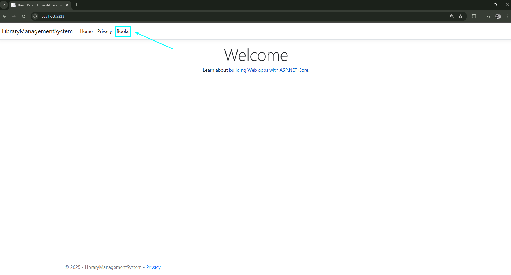
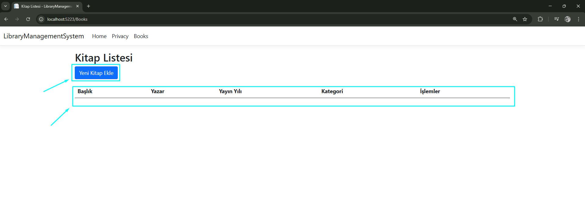
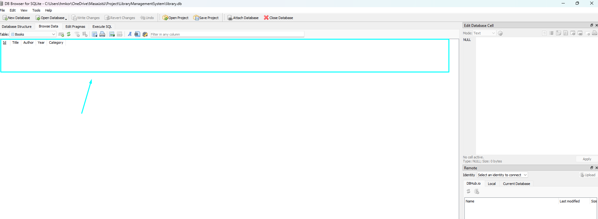
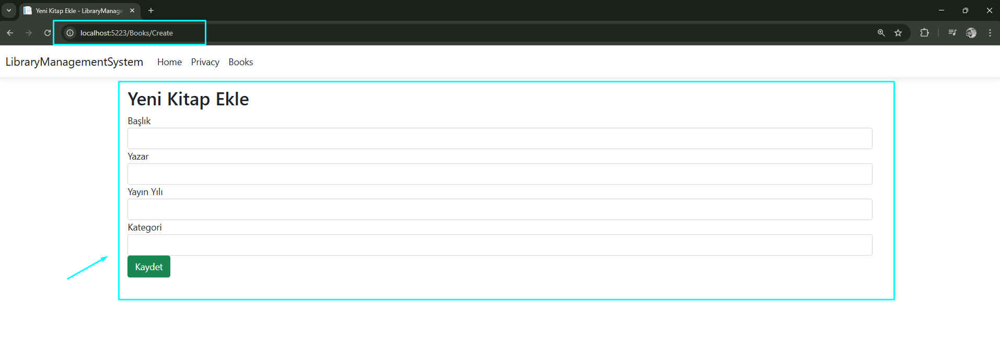
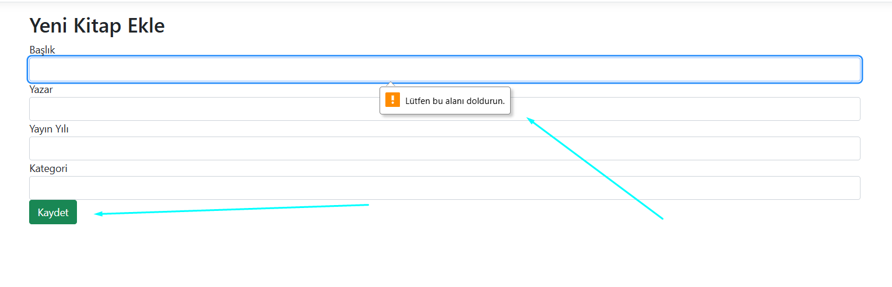
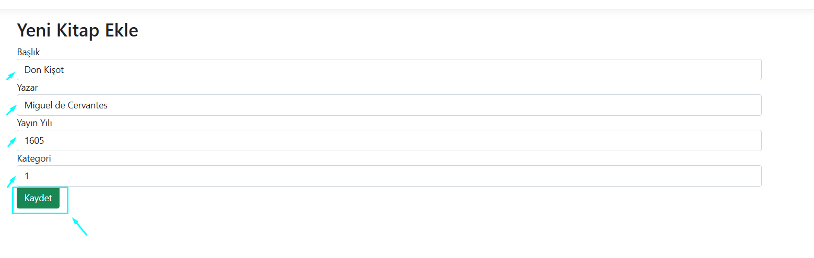
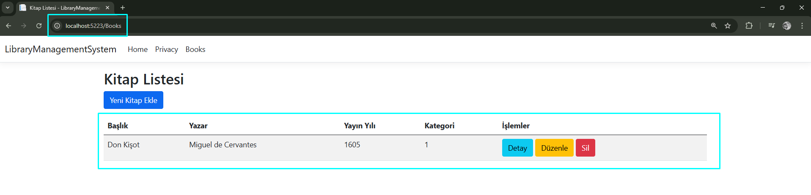
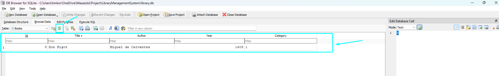
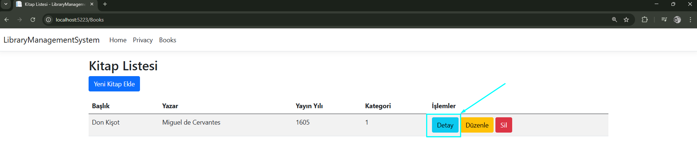
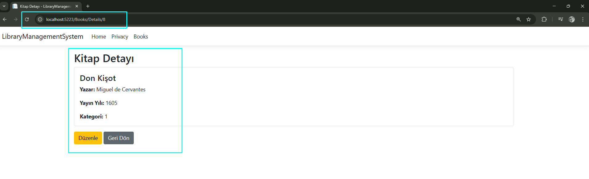
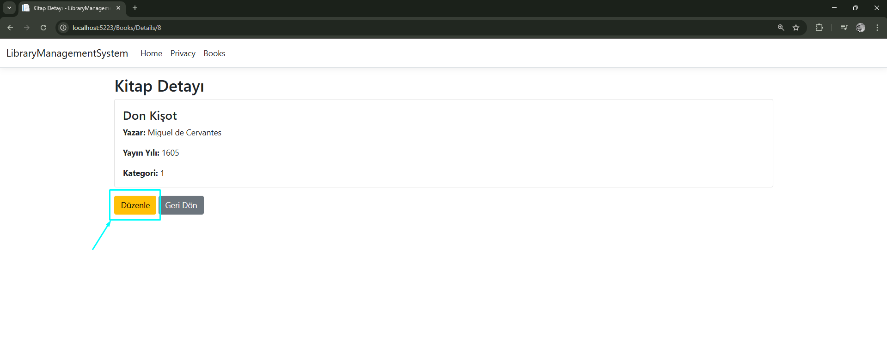
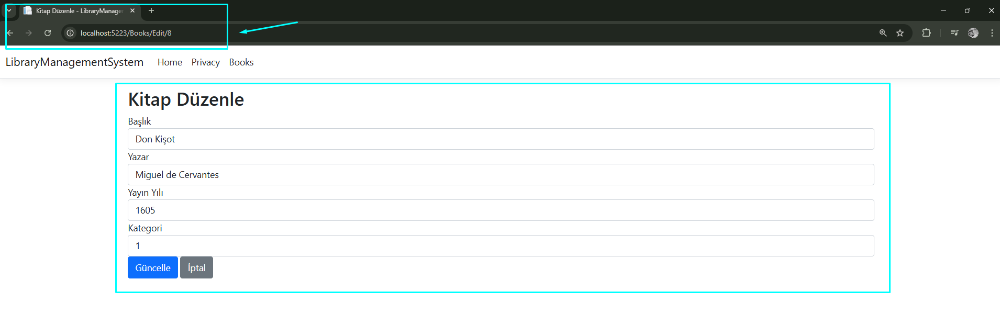
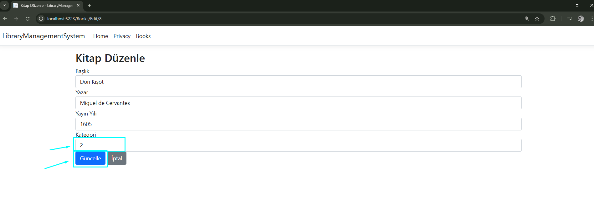
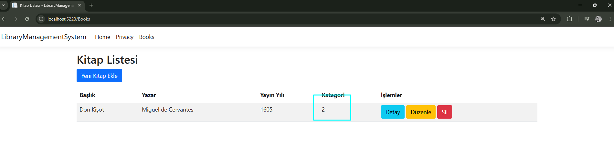
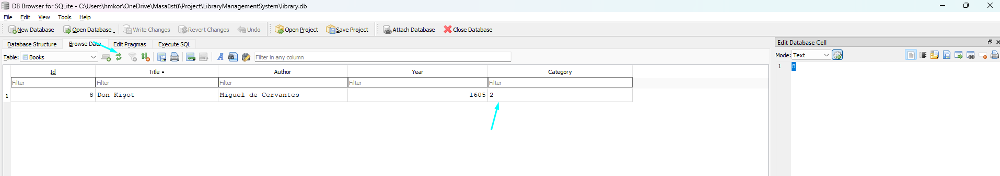

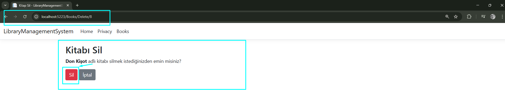
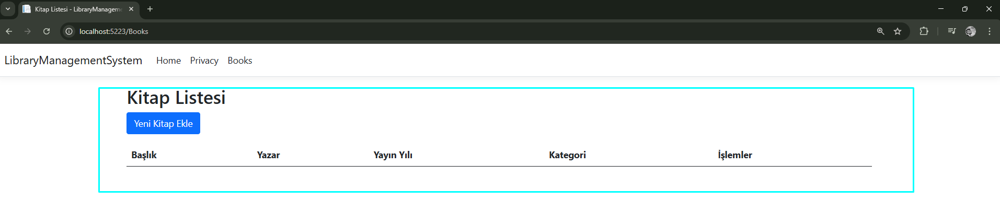
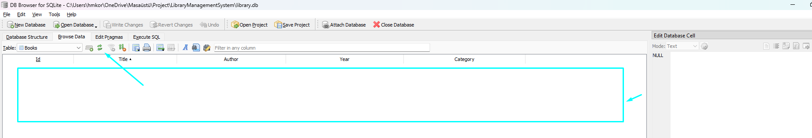
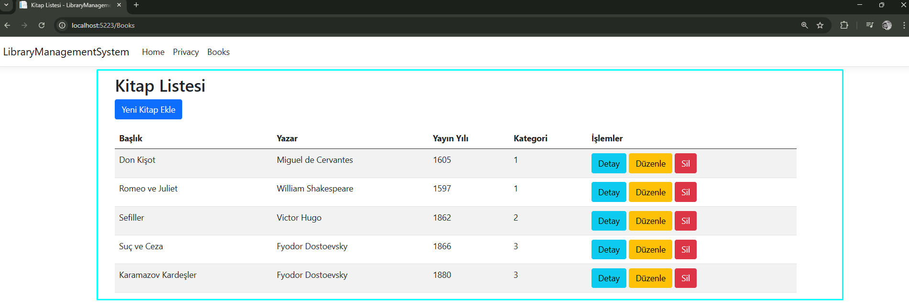
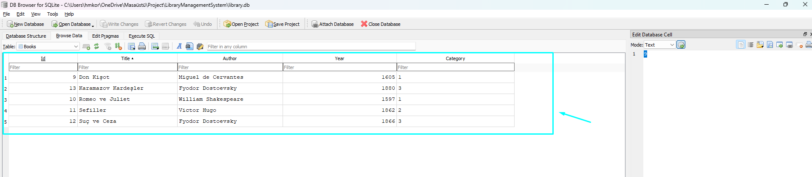

## Planlanan Güncellemeler  
- Daha modern bir Bootstrap teması eklenecek.  
- Dark Mode (Koyu Tema) desteği eklenecek.  
- Kitap kapak resimleri desteklenecek.  

